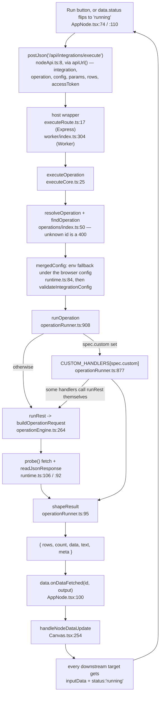

# Bernie — the architectural spine

For someone about to change something: the load-bearing structure and where it
gives, not a file listing. See [README.md](README.md) to get it running and
[PLAN.md](PLAN.md) for direction.

Five ideas carry the system:

1. An API call is a **declarative spec**, not a route.
2. Every app-scoped node run takes **one path** through **one route**.
3. That route has **two hosts and one implementation** — Express and a
   Cloudflare Worker.
4. Data moves between nodes by **writing React state on the targets**.
5. Credentials **layer**, and never blank each other out.

---

## 1. The operation registry

`src/lib/operations/` holds ~82 operation specs across 12 integrations, in four
files grouped by vendor (`asana.ts`, `google.ts`, `data.ts`, `tools.ts`) plus
`types.ts` and `index.ts`. Adding an API call is an entry in one of those
lists — not a new route, not a new handler, not a new node component.

One spec drives three things at once: the operation picker in the node, the
form fields it renders, and the HTTP request the server builds. That is why the
UI and the server cannot drift — `operationsFor()` and `resolveOperation()`
(`src/lib/operations/index.ts:32`, `:50`) are the same functions on both sides.

A real one, `src/lib/operations/google.ts:13`:

```ts
{
  id: 'values.pull',                  // stored on the node as data.operation
  label: 'Pull data',                 // the picker entry
  direction: 'pull',                  // drives the node's badge and icon
  summary: 'Reads a range and emits one row per sheet row, using the header row for keys.',
  docsUrl: 'https://developers.google.com/sheets/api/reference/rest/v4/spreadsheets.values/get',
  method: 'GET',
  path: '/v4/spreadsheets/{spreadsheetId}/values/{range}',
  //   ^ appended to the transport's base URL. Every {name} is REQUIRED: it is
  //     filled by resolveParam, and a blank one aborts the build with a message
  //     naming the missing key (operationEngine.ts:286).
  query: ['majorDimension', 'valueRenderOption'],
  //   ^ param keys copied to the query string WHEN SET. Nothing supplies a
  //     default, so an omitted key is simply absent — see Known rough edges.
  result: 'sheetValues',              // how shapeResult post-processes the response
  emitsRows: true,                    // this operation feeds downstream nodes
  fields: [                           // rendered into the node's edit view
    textField('spreadsheetId', 'Spreadsheet ID', 'Defaults to the connection setting'),
    textField('range', 'Range', 'Sheet1', RANGE_HELP),
    { key: 'headerRow', label: 'First row holds the column names', type: 'checkbox' },
    // ... valueRenderOption select elided
  ],
}
```

The rest of `OperationSpec` (`src/lib/operations/types.ts`):

- **`body`** — how the body is assembled: `rows` (input rows as a JSON array),
  `params`, `rawBody`, `asanaData` (Asana's `{ data: ... }` wrapper),
  `sheetValues` (Sheets' `{ range, majorDimension, values }`), or `none`.
- **`resultPath`** — dot path into the response before shaping, e.g. `"data"`.
- **`consumesRows` / `emitsRows`** — the contract with the canvas.
  `consumesRows` makes the runner refuse an empty input
  (`operationRunner.ts:914`) and makes the node show a "waiting for input rows"
  strip.
- **`custom`** — the escape hatch, for an operation that is not one REST call.
  Set it and add a handler under that key to `CUSTOM_HANDLERS`
  (`src/server/operationRunner.ts:877`). Asana `tasks.create`
  (`operations/asana.ts:62`) is the clearest case: Asana creates one task per
  request, so a row set has to become a request per row — the generic path
  would send only the first row.

`rawOperation()` in `types.ts` gives every REST integration a "call any
endpoint" spec for free, so an uncovered call is never a blocker.

---

## 2. The one execution path



Before you change any link in that chain:

- **`buildOperationRequest` is pure** (`operationEngine.ts:264`): spec + params
  + config + rows in, `{ method, url, headers, body }` out. No network, no Node
  built-ins, no React. That is deliberate and `PLAN.md` depends on it staying
  that way; `tests/unit/operationEngine.test.ts` exercises it directly.
- **`transportFor`** (`operationEngine.ts:27`) is the only place base URLs and
  auth headers live. A missing credential throws there, naming the app, instead
  of producing a request that 401s.
- **`resolveParam`** (`operationEngine.ts:159`) is what lets a node leave a
  field blank: node param, else the mapped connection default from
  `PARAM_DEFAULTS` (`:128`), else a literal from `PARAM_FALLBACKS` (`:149`).
- **Custom handlers are not a separate path.** Several call `runRest` with
  `custom` stripped and then post-process (`runSheetsPreview`, `runGithubList`,
  `runGithubContent`). Only genuinely non-REST work — MCP's initialize
  handshake, Gemini, per-row loops — is fully bespoke.
- **`shapeResult`** (`operationRunner.ts:95`) is the single funnel from vendor
  response to rows. Every new `ResultShape` goes in that switch.
- **Errors carry the upstream status.** `UpstreamError` (`:73`) wraps the
  provider's own message and `executeCore.ts:87` returns it verbatim, so a
  node shows "Asana: Not a valid project" rather than a bare 500.

---

## 3. Two hosts, one implementation

`/api/integrations/execute` is served by Express in development and by a
Cloudflare Worker in deployment. There is one implementation of it:
`executeOperation` (`src/server/executeCore.ts:25`), which has no HTTP
framework in it at all. `executeRoute.ts:17` is the Express wrapper;
`worker/index.ts:304` is the Worker's. If a node behaves differently on the two,
one of those wrappers is wrong, not the core.

**Why this exists.** A statically hosted front end — Google AI Studio, a built
`dist/` on a file server, Cloudflare Pages — has no Express process behind the
page, so every `POST /api/*` was answered by the file server with **405**. The
fix was to make the API deployable rather than to make the client tolerate the
405.

The split that made it possible:

- **`src/server/runtime.ts`** holds the half of the plumbing with no Node in
  it: `envConfig(id, env)` (`:27`), `mergedConfig` (`:84`), `readJsonResponse`
  (`:92`), `probe` (`:106`), `errorStatus` (`:115`), and `ambientEnv` (`:18`),
  which returns `process.env` where there is one and `{}` where there is not.
  Nothing in this file may import express, `@google/genai`, or a `node:`
  module. `integrationKit.ts:15` re-exports all of it, so importers that
  predate the move are unaffected.
- **`integrationKit.ts` is now the Node-only half**: the `@google/genai` client
  built at module load from `process.env.GEMINI_API_KEY` (`:22`) and
  `geminiFor` (`:49`).
- **Gemini is injected, not imported.** `RunContext.gemini`
  (`operationRunner.ts:69`) is a function returning a `GeminiClient`
  (`:43`) — three fields, no SDK. Express injects the SDK
  (`executeRoute.ts:21`); the Worker injects a REST implementation
  (`worker/index.ts:240`). Absent, Gemini operations report themselves
  unconfigured rather than crashing.
- **`atob`, not `Buffer`.** GitHub file content is decoded with
  `atob` + `TextDecoder` (`operationRunner.ts:631`). That was the last Node
  built-in on the execution path.

**On the client side**, every fetch goes through `apiUrl()`
(`src/lib/apiBase.ts:47`) — `src/lib/nodeApi.ts:9`, `src/lib/workflowStore.ts:70`,
`AiNode.tsx:18`, `HttpNode.tsx:25` and `:59`. It resolves to same-origin unless
the `localStorage` key `bernie-api-base` (runtime) or `VITE_API_BASE_URL`
(build time) says otherwise, in that order. `apiHeaders()` (`:76`) is the
companion: JSON plus `X-Bernie-Key` from `bernie-api-key` when one is set. Both
are written by the **API endpoint** card
(`src/components/ApiEndpointCard.tsx`), whose Test button separates "cannot
reach it" from "reached it, wrong key" by checking the unauthenticated
`/api/health` first and a gated route second.

`describeApiFailure` (`:98`) is where a status becomes a sentence: 405/501
means a static file server answered, 401 means the key was rejected, 503 means
the Worker has no secret configured. That mapping is the point — every one of
those is a deployment mistake the status code alone does not name.

**Not everything routes through `apiHeaders` yet.** `AiNode` (`:20`),
`HttpNode` (`:27`, `:61`) still build `{ 'Content-Type': 'application/json' }`
by hand, so `/api/ai/execute`, `/api/ai/parse-request` and `/api/proxy` carry
no key. Those three are Express-only routes the Worker does not serve, so this
does not break the dev server — but it does mean those nodes have no path that
works on a static deployment.

---

## 4. How data moves on the canvas

There is no scheduler. **Execution is the React tree.**

`handleNodeDataUpdate` (`src/components/Canvas.tsx:254`) does two things in one
`setNodes` pass:

1. Writes the source node's result into a type-specific key — `mappedData` for
   `sheet`/`drive`/`chat`/`meet`, `response` for `http`, `result` for
   `ai`/`script`, `flushedData` for `flush`, `jsonData` for everything else —
   and sets `status: 'success'`.
2. Finds every edge with `source === nodeId` and, on each target node, sets
   `inputData` to that same output and `status: 'running'`.

Each runnable node component watches for the flip:

```tsx
useEffect(() => { if (data.status === 'running') run(); }, [data.status]);
```

(`AppNode.tsx:110`, `ScriptNode.tsx:33`, and the same shape elsewhere.)

**Consequences you have to design around:**

- **Fan-out works.** Two targets both receive the same `inputData` and both
  start. The default workflow relies on this: the ranked rows go to the Sheets
  write-back and to the Top-10 script.
- **Fan-in does not merge.** A node with two incoming edges is written twice
  and the second write replaces `inputData` — last writer wins. No join, no
  wait-for-all, no accumulation. If you need a merge, you have to build it.
- **Errors do not cascade.** When the payload carries `error`, the source is
  marked `error` and no target is touched (`Canvas.tsx:281`), so a failed
  branch stops.
- **A cycle would loop forever.** `detectGraphCycles` exists
  (`workflowEngine.ts:70`) but the canvas never calls it.
- **Nothing runs with the tab closed**, and there is no run history — the only
  record is what sits on the node. Only `nodes` and `edges` autosave, debounced
  1s, into `localStorage` under `bernie-autosave` (`Canvas.tsx:204`).
- **Callbacks cannot be serialized.** `onDataFetched` and `runWorkflow` are
  stripped by autosave, so they are re-attached after a load
  (`Canvas.tsx:321`) and again defensively every render in `nodesWithCallbacks`
  (`Canvas.tsx:614`). The same re-attach happens on a mermaid import
  (`Canvas.tsx:358`) and on a workflow loaded from D1 (`:369`).
- **`AppNode` deliberately does not call `updateNodeData`** for results
  (`AppNode.tsx:97`). Canvas owns node data through `useNodesState`; writing
  from both places races and silently drops one.
- **Sticky notes are outside all of this.** `StickyNote`
  (`src/components/nodes/StickyNote.tsx`) renders no `Handle`, so no edge can
  attach to one; it has no `status === 'running'` effect, so it never runs; it
  writes its own text with `updateNodeData` (`:39`) because nothing else owns
  it. Every consumer of the graph has to know that: mermaid import drops edges
  touching a note (`mermaid.ts:222`) and `toMermaid` omits notes entirely
  (`:236`), and the code generator treats `sticky` as non-executing
  (`workflowCode.ts:16`) and emits the text as `// note:` comments (`:127`).

---

## 5. Credential precedence

Node credentials → node params → saved connection → env. Documented at
`src/lib/nodeConfig.ts:1`, implemented in two halves:

- **Browser** — `nodeConfigFor` (`nodeConfig.ts:51`) starts from the saved
  connection (`getIntegration`, `localStorage` key `bernie-integrations`),
  layers on the node's `params` **filtered to keys the integration schema
  declares** — so a stray param cannot masquerade as a credential — then the
  node's `credentials` on top. The merged config goes in the request body.
- **Server** — `mergedConfig` (`runtime.ts:84`) puts `envConfig(id, env)`
  (`:27`) *underneath* whatever the browser sent. `env` is the host's bag:
  `process.env` under Express, the Worker's `env` binding under Cloudflare.

Both merges run through `resolveConfig` (`integrationCore.ts:406`), whose one
rule is that a blank value never overwrites a set one. That rule is what makes
every level safe to leave half-filled.

Which fields are secrets is derived, not declared twice: `credentialFields`
(`nodeConfig.ts:27`) is "the `password` fields of the schema", so a node's
credential block cannot drift from `INTEGRATION_SCHEMAS`
(`integrationCore.ts:187`).

---

## 6. Saved workflows, and what scopes them

A workflow can be saved by name into a Cloudflare D1 database called
`bernie-workflows`. The Worker is the only thing that talks to it
(`worker/index.ts:149`); the Express dev server forwards `/api/workflows` to
`WORKER_URL` (`server.ts:200`) rather than holding a second implementation.

- **The graph is opaque to SQL on purpose** (`migrations/0001_workflows.sql`).
  Nodes and edges change shape as the canvas grows; a schema mirroring them
  would need a migration every time a node gained a field. The columns are only
  what the list view and ownership need without parsing the graph.
- **Four operations, one route.** `GET /api/workflows` lists, `GET
  /api/workflows/:id` reads one with its graph, `POST` or `PUT` upserts, and
  `DELETE /api/workflows/:id` removes. Plus `/api/health`. Client side that is
  `src/lib/workflowStore.ts`.
- **Transient node fields never reach the database.** `serializeGraph`
  (`workflowStore.ts:42`) deletes `onDataFetched`, `runWorkflow`, `status`,
  `errorMessage`, `inputData`, `lastRunMeta` and `lastRunCount` — functions do
  not survive JSON, and a graph saved mid-run would come back still claiming to
  be running.
- **There are two different notions of "who" here, and only one of them is
  checked.** The Worker gates every route except `/api/health` on a **shared
  secret** — `denyUnlessAuthorized` (`worker/index.ts:55`) compares the
  `X-Bernie-Key` header against `env.BERNIE_API_SECRET` in constant time
  (`timingSafeEqual`, `:77`), 401 on a mismatch. It **fails closed**: an unset
  secret returns 503 rather than serving openly, which is the right default for
  something that will fetch whatever an `http` node names. That stops the
  internet. It does not distinguish users: everyone using the app holds the
  same key.
- **The owner, by contrast, is the `sub` claim of the Supabase access token
  read without verifying the signature** (`ownerFrom`, `worker/index.ts:98`).
  It is enough to keep one person's list separate from another's, and it is
  **not access control**: anyone past the shared secret can mint a token with
  any `sub` and read or overwrite that owner's rows. Verifying against the
  Supabase project's JWKS is the fix; until then the store is scoped, not
  secured. Tracked in `TODO.md`.
- **Ownership is at least enforced consistently.** The upsert's
  `WHERE workflows.owner = excluded.owner` (`worker/index.ts:199`) means saving
  over someone else's id changes nothing and reads back 403, and every read and
  delete carries `AND owner = ?`. Signed out, rows are owned by the literal
  string `anonymous`, which is shared by every signed-out user.
- **CORS is `*`** (`worker/index.ts:34`), because in every deployment that
  needs the Worker the front end is on a different origin. The shared secret,
  not the origin, is what the Worker actually trusts — so a browser holding the
  key on any page can call it.

---

## 7. The simulation gap

`src/lib/workflowEngine.ts` is a second, parallel implementation of ideas the
running app also has — and **nothing in `src/` imports it.** Its only consumer
is `tests/unit/workflowEngine.test.ts`.

- `propagateNodeData` (`:291`) mirrors `handleNodeDataUpdate`, including the
  node-type-to-output-key mapping, duplicated verbatim. Change propagation
  semantics in `Canvas.tsx` and this drifts silently.
- `simulateWorkflowExecution` (`:564`) is a genuine topological executor: cycle
  detection, a work queue, per-step input/output/duration capture, a step
  report shaped exactly like a run history. But it calls
  `executeNodeSimulation` (`:361`), which fakes every node with local
  JavaScript. **No integration is contacted** — it never touches
  `/api/integrations/execute` or `runOperation`.
- `validateWorkflow` (`:120`) is likewise never called by the UI.

So green tests in `workflowEngine.test.ts` are not evidence that a real run
works. This is not accidental: `PLAN.md` Phase 1 is precisely to keep that
traversal and swap the one `executeNodeSimulation` call for `runOperation`.
Treat the file as a staging area for the real executor, not as live code.

---

## 8. How do I add X

**A new operation on an existing integration.** Add an `OperationSpec` to the
right list in `src/lib/operations/`. If it is one REST call, that is the entire
change — the picker reads `operationsFor()`, the node form renders `fields`,
`buildOperationRequest` builds the request. If it is not, set
`custom: '<key>'` and add the handler to `CUSTOM_HANDLERS`
(`operationRunner.ts:877`). A `custom` key with no handler throws on the first
run (`:920`), so a typo fails loudly rather than silently falling back to REST.
A handler that needs Gemini takes it from `ctx.gemini` (`:69`) rather than
importing the SDK, or it will not run on the Worker.

**A new integration.**

1. `integrationCore.ts` — add to the `IntegrationId` union (`:7`),
   `INTEGRATION_IDS` (`:21`), `INTEGRATION_SCHEMAS` (`:187`) and
   `DEFAULT_INTEGRATION_CONFIG` (`:364`). `password` fields automatically
   become the credential set.
2. `operationEngine.ts` — a `case` in `transportFor` (`:27`) for base URL and
   auth headers; optionally `PARAM_DEFAULTS` (`:128`) so nodes inherit
   connection defaults, and `PARAM_FALLBACKS` (`:149`) for literals.
3. `src/lib/operations/` — an `IntegrationOperations` export and an entry in
   `REGISTRY` (`operations/index.ts:16`).
4. `runtime.ts` — env fallbacks in `envConfig` (`:27`), reading from the `env`
   argument rather than `process.env`, plus a line in `.env.example`.
5. `server.ts:453` — optionally a branch in the `/api/integrations/test` chain,
   so the Integrations page can smoke-test the credential. Express only; the
   Worker does not serve that route.
6. Presentation — an entry in `APP_NODE_STYLES` (`nodes/appNodes.tsx:19`), the
   exported `makeAppNode` component, and its key in `nodeTypes`
   (`Canvas.tsx:120`). Optionally a hint in `INTEGRATION_HINTS`
   (`src/lib/mermaid.ts:25`) so a pasted flowchart naming the app maps onto it.

No new route, no new server handler, no new node component.

**A new node type (not app-scoped).** A component under
`src/components/nodes/` and a key in `nodeTypes` (`Canvas.tsx:120`). The
load-bearing part is the participation contract:

```tsx
useEffect(() => { if (data.status === 'running') run(); }, [data.status]);
// and, at the end of run():
data.onDataFetched?.(id, output);          // or { error: message } on failure
```

Without both, the node renders but never runs and never feeds anything. Add its
data shape to `src/types.ts`, and a branch in `handleNodeDataUpdate`
(`Canvas.tsx:254`) if its output should land somewhere other than `jsonData`.
A node that is annotation rather than a step opts out of both and goes in
`NON_EXECUTING` (`workflowCode.ts:16`) instead — see `StickyNote`.

---

## Known rough edges

Verified against the code, not folklore.

- **Sheets writes omit a required query parameter.** `values.append` and
  `values.update` declare `query: ['valueInputOption']`
  (`operations/google.ts:71`, `:89`), but nothing supplies a value: not in the
  spec's `fields`, not in `PARAM_DEFAULTS.sheets`, not in
  `PARAM_FALLBACKS.sheets` (`operationEngine.ts:128`, `:149`). So
  `buildOperationRequest` omits it and the Sheets API rejects the call. The
  working value is hardcoded in the older non-registry path
  (`providerRequests.ts:37`, `:44`). This is the default workflow's write-back
  node.
- **ScriptNode's editor is one-way.** An edit on the canvas now writes through
  to node data (`editScript`, `ScriptNode.tsx:15`), so it survives a reload.
  The reverse does not hold: `scriptVal` is seeded once from `data.script`
  (`:10`) and never re-synced, so a script changed in the settings pane
  (`NodeSettingsForm.tsx:172`) does not appear in the on-canvas textarea, and
  the next keystroke there overwrites it.
- **Dead routes.** Nothing in `src/` calls `/api/asana/tasks`
  (`server.ts:226`), `/api/keepa/products` (`:261`), `/api/supabase/rows`
  (`:294`), `/api/sheets/rows` (`:333`), `/api/ai/suggest` (`:66`), or any of
  the five routes in `src/server/providerRoutes.ts` (`:39`, `:81`, `:120`,
  `:182`, `:281`). They predate `/api/integrations/execute` and are reachable
  only by hand. The live client routes are `/api/integrations/execute`,
  `/api/integrations/test`, `/api/workflows`, `/api/ai/execute`,
  `/api/ai/parse-request`, `/api/ai/insights` and `/api/proxy`.
- **The dead routes now duplicate the Worker as well.** They exist only on
  Express, they still accept credentials in the body, and they cover the same
  vendors the Worker serves through one route. Deleting them costs nothing and
  removes an Express-only surface that no deployment target has.
- **The Worker has one key for everyone, and no rate limiting.** The shared
  secret keeps the internet out; it does not tell one user from another, does
  not revoke, and is held in every user's `localStorage` under
  `bernie-api-key`. Anyone holding it can call `/api/integrations/execute`,
  which will fetch whatever an `http` node or a `raw.request` operation names.
  Per-request cost lands on D1 or on a third party's key, and nothing bounds
  the rate.
- **Three client fetches skip `apiHeaders()`.** `AiNode.tsx:20` and
  `HttpNode.tsx:27`/`:61` set their own headers, so `/api/ai/execute`,
  `/api/ai/parse-request` and `/api/proxy` go out with no key. Harmless against
  Express, which does not check; those nodes simply do not work against a
  Worker, which does — and which does not serve those routes anyway.
- **Saving always creates a new workflow.** `SavedTab` calls `saveWorkflow`
  with no `id` (`WorkflowPanel.tsx:210`), and the Worker mints a fresh UUID
  when one is absent (`worker/index.ts:128`), so saving twice under the same
  name leaves two rows. The upsert path exists; nothing in the UI reaches it.
- **`BERNIE_API_SECRET` is not in `.env.example`.** It has to match in three
  places — the deployed Worker's secret, `.dev.vars` for `wrangler dev`, and
  `.env` for the dev server's proxy — and the file that is supposed to be the
  reference for variable names does not mention it.
- **`/api/integrations/test` is an 11-branch if-chain** (`server.ts:453`), left
  that way deliberately — see `PLAN.md`.
- **`npm start` needs `NODE_ENV=production`**; the bundle still branches on it
  (`server.ts:669`).
