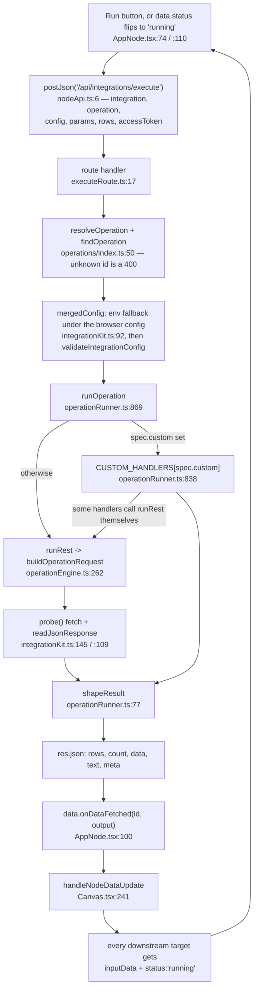

# Bernie — the architectural spine

For someone about to change something: the load-bearing structure and where it
gives, not a file listing. See [README.md](README.md) to get it running and
[PLAN.md](PLAN.md) for direction.

Four ideas carry the system:

1. An API call is a **declarative spec**, not a route.
2. Every app-scoped node run takes **one path** through **one route**.
3. Data moves between nodes by **writing React state on the targets**.
4. Credentials **layer**, and never blank each other out.

---

## 1. The operation registry

`src/lib/operations/` holds ~82 operation specs across 12 integrations, in four
files grouped by vendor (`asana.ts`, `google.ts`, `data.ts`, `tools.ts`) plus
`types.ts` and `index.ts`. Adding an API call is an entry in one of those
lists — not a new route, not a new handler, not a new node component.

One spec drives three things at once: the operation picker in the node, the
form fields it renders, and the HTTP request the server builds. That is why the
UI and the server cannot drift — `operationsFor()` and `resolveOperation()`
(`src/lib/operations/index.ts:32`, `:50`) are the same functions on both sides.

A real one, `src/lib/operations/google.ts:13`:

```ts
{
  id: 'values.pull',                  // stored on the node as data.operation
  label: 'Pull data',                 // the picker entry
  direction: 'pull',                  // drives the node's badge and icon
  summary: 'Reads a range and emits one row per sheet row, using the header row for keys.',
  docsUrl: 'https://developers.google.com/sheets/api/reference/rest/v4/spreadsheets.values/get',
  method: 'GET',
  path: '/v4/spreadsheets/{spreadsheetId}/values/{range}',
  //   ^ appended to the transport's base URL. Every {name} is REQUIRED: it is
  //     filled by resolveParam, and a blank one aborts the build with a message
  //     naming the missing key (operationEngine.ts:276).
  query: ['majorDimension', 'valueRenderOption'],
  //   ^ param keys copied to the query string WHEN SET. Nothing supplies a
  //     default, so an omitted key is simply absent — see Known rough edges.
  result: 'sheetValues',              // how shapeResult post-processes the response
  emitsRows: true,                    // this operation feeds downstream nodes
  fields: [                           // rendered into the node's edit view
    textField('spreadsheetId', 'Spreadsheet ID', 'Defaults to the connection setting'),
    textField('range', 'Range', 'Sheet1', RANGE_HELP),
    { key: 'headerRow', label: 'First row holds the column names', type: 'checkbox' },
    // ... valueRenderOption select elided
  ],
}
```

The rest of `OperationSpec` (`src/lib/operations/types.ts`):

- **`body`** — how the body is assembled: `rows` (input rows as a JSON array),
  `params`, `rawBody`, `asanaData` (Asana's `{ data: ... }` wrapper),
  `sheetValues` (Sheets' `{ range, majorDimension, values }`), or `none`.
- **`resultPath`** — dot path into the response before shaping, e.g. `"data"`.
- **`consumesRows` / `emitsRows`** — the contract with the canvas.
  `consumesRows` makes the runner refuse an empty input
  (`operationRunner.ts:875`) and makes the node show a "waiting for input rows"
  strip.
- **`custom`** — the escape hatch, for an operation that is not one REST call.
  Set it and add a handler under that key to `CUSTOM_HANDLERS`
  (`src/server/operationRunner.ts:838`). Asana `tasks.create`
  (`operations/asana.ts:62`) is the clearest case: Asana creates one task per
  request, so a row set has to become a request per row — the generic path
  would send only the first row.

`rawOperation()` in `types.ts` gives every REST integration a "call any
endpoint" spec for free, so an uncovered call is never a blocker.

---

## 2. The one execution path



Before you change any link in that chain:

- **`buildOperationRequest` is pure** (`operationEngine.ts:262`): spec + params
  + config + rows in, `{ method, url, headers, body }` out. No network, no Node
  built-ins, no React. That is deliberate and `PLAN.md` depends on it staying
  that way; `tests/unit/operationEngine.test.ts` exercises it directly.
- **`transportFor`** (`operationEngine.ts:27`) is the only place base URLs and
  auth headers live. A missing credential throws there, naming the app, instead
  of producing a request that 401s.
- **`resolveParam`** (`operationEngine.ts:157`) is what lets a node leave a
  field blank: node param, else the mapped connection default from
  `PARAM_DEFAULTS` (`:128`), else a literal from `PARAM_FALLBACKS` (`:149`).
- **Custom handlers are not a separate path.** Several call `runRest` with
  `custom` stripped and then post-process (`runSheetsPreview`, `runGithubList`,
  `runGithubContent`). Only genuinely non-REST work — MCP's initialize
  handshake, the Gemini SDK, per-row loops — is fully bespoke.
- **`shapeResult`** (`operationRunner.ts:77`) is the single funnel from vendor
  response to rows. Every new `ResultShape` goes in that switch.
- **Errors carry the upstream status.** `UpstreamError` (`:55`) wraps the
  provider's own message and `executeRoute.ts:70` returns it verbatim, so a
  node shows "Asana: Not a valid project" rather than a bare 500.

---

## 3. How data moves on the canvas

There is no scheduler. **Execution is the React tree.**

`handleNodeDataUpdate` (`src/components/Canvas.tsx:241`) does two things in one
`setNodes` pass:

1. Writes the source node's result into a type-specific key — `mappedData` for
   `sheet`/`drive`/`chat`/`meet`, `response` for `http`, `result` for
   `ai`/`script`, `flushedData` for `flush`, `jsonData` for everything else —
   and sets `status: 'success'`.
2. Finds every edge with `source === nodeId` and, on each target node, sets
   `inputData` to that same output and `status: 'running'`.

Each runnable node component watches for the flip:

```tsx
useEffect(() => { if (data.status === 'running') run(); }, [data.status]);
```

(`AppNode.tsx:110`, `ScriptNode.tsx:33`, and the same shape elsewhere.)

**Consequences you have to design around:**

- **Fan-out works.** Two targets both receive the same `inputData` and both
  start. The default workflow relies on this: the ranked rows go to the Sheets
  write-back and to the Top-10 script.
- **Fan-in does not merge.** A node with two incoming edges is written twice
  and the second write replaces `inputData` — last writer wins. No join, no
  wait-for-all, no accumulation. If you need a merge, you have to build it.
- **Errors do not cascade.** When the payload carries `error`, the source is
  marked `error` and no target is touched (`Canvas.tsx:268`), so a failed
  branch stops.
- **A cycle would loop forever.** `detectGraphCycles` exists
  (`workflowEngine.ts:70`) but the canvas never calls it.
- **Nothing runs with the tab closed**, and there is no run history — the only
  record is what sits on the node. Only `nodes` and `edges` autosave, debounced
  1s, into `localStorage` under `bernie-autosave` (`Canvas.tsx:192`).
- **Callbacks cannot be serialized.** `onDataFetched` and `runWorkflow` are
  stripped by autosave, so they are re-attached after a load
  (`Canvas.tsx:299`) and again defensively every render in `nodesWithCallbacks`
  (`Canvas.tsx:551`).
- **`AppNode` deliberately does not call `updateNodeData`** for results
  (`AppNode.tsx:97`). Canvas owns node data through `useNodesState`; writing
  from both places races and silently drops one.

---

## 4. Credential precedence

Node credentials → node params → saved connection → env. Documented at
`src/lib/nodeConfig.ts:1`, implemented in two halves:

- **Browser** — `nodeConfigFor` (`nodeConfig.ts:51`) starts from the saved
  connection (`getIntegration`, `localStorage` key `bernie-integrations`),
  layers on the node's `params` **filtered to keys the integration schema
  declares** — so a stray param cannot masquerade as a credential — then the
  node's `credentials` on top. The merged config goes in the request body.
- **Server** — `mergedConfig` (`integrationKit.ts:92`) puts `envConfig(id)`
  (`:35`) *underneath* whatever the browser sent.

Both merges run through `resolveConfig` (`integrationCore.ts:406`), whose one
rule is that a blank value never overwrites a set one. That rule is what makes
every level safe to leave half-filled.

Which fields are secrets is derived, not declared twice: `credentialFields`
(`nodeConfig.ts:27`) is "the `password` fields of the schema", so a node's
credential block cannot drift from `INTEGRATION_SCHEMAS`
(`integrationCore.ts:187`).

---

## 5. The simulation gap

`src/lib/workflowEngine.ts` is a second, parallel implementation of ideas the
running app also has — and **nothing in `src/` imports it.** Its only consumer
is `tests/unit/workflowEngine.test.ts`.

- `propagateNodeData` (`:291`) mirrors `handleNodeDataUpdate`, including the
  node-type-to-output-key mapping, duplicated verbatim. Change propagation
  semantics in `Canvas.tsx` and this drifts silently.
- `simulateWorkflowExecution` (`:564`) is a genuine topological executor: cycle
  detection, a work queue, per-step input/output/duration capture, a step
  report shaped exactly like a run history. But it calls
  `executeNodeSimulation` (`:361`), which fakes every node with local
  JavaScript. **No integration is contacted** — it never touches
  `/api/integrations/execute` or `runOperation`.
- `validateWorkflow` (`:120`) is likewise never called by the UI.

So green tests in `workflowEngine.test.ts` are not evidence that a real run
works. This is not accidental: `PLAN.md` Phase 1 is precisely to keep that
traversal and swap the one `executeNodeSimulation` call for `runOperation`.
Treat the file as a staging area for the real executor, not as live code.

---

## 6. How do I add X

**A new operation on an existing integration.** Add an `OperationSpec` to the
right list in `src/lib/operations/`. If it is one REST call, that is the entire
change — the picker reads `operationsFor()`, the node form renders `fields`,
`buildOperationRequest` builds the request. If it is not, set
`custom: '<key>'` and add the handler to `CUSTOM_HANDLERS`
(`operationRunner.ts:838`). A `custom` key with no handler throws on the first
run (`:880`), so a typo fails loudly rather than silently falling back to REST.

**A new integration.**

1. `integrationCore.ts` — add to the `IntegrationId` union (`:7`),
   `INTEGRATION_IDS` (`:21`), `INTEGRATION_SCHEMAS` (`:187`) and
   `DEFAULT_INTEGRATION_CONFIG` (`:364`). `password` fields automatically
   become the credential set.
2. `operationEngine.ts` — a `case` in `transportFor` (`:27`) for base URL and
   auth headers; optionally `PARAM_DEFAULTS` (`:128`) so nodes inherit
   connection defaults, and `PARAM_FALLBACKS` (`:149`) for literals.
3. `src/lib/operations/` — an `IntegrationOperations` export and an entry in
   `REGISTRY` (`operations/index.ts:16`).
4. `integrationKit.ts` — env fallbacks in `envConfig` (`:35`), plus a line in
   `.env.example`.
5. `server.ts:410` — optionally a branch in the `/api/integrations/test` chain,
   so the Integrations page can smoke-test the credential.
6. Presentation — an entry in `APP_NODE_STYLES` (`nodes/appNodes.tsx:19`), the
   exported `makeAppNode` component, and its key in `nodeTypes`
   (`Canvas.tsx:113`).

No new route, no new server handler, no new node component.

**A new node type (not app-scoped).** A component under
`src/components/nodes/` and a key in `nodeTypes` (`Canvas.tsx:113`). The
load-bearing part is the participation contract:

```tsx
useEffect(() => { if (data.status === 'running') run(); }, [data.status]);
// and, at the end of run():
data.onDataFetched?.(id, output);          // or { error: message } on failure
```

Without both, the node renders but never runs and never feeds anything. Add its
data shape to `src/types.ts`, and a branch in `handleNodeDataUpdate`
(`Canvas.tsx:241`) if its output should land somewhere other than `jsonData`.

---

## Known rough edges

Verified against the code, not folklore.

- **Sheets writes omit a required query parameter.** `values.append` and
  `values.update` declare `query: ['valueInputOption']`
  (`operations/google.ts:71`, `:89`), but nothing supplies a value: not in the
  spec's `fields`, not in `PARAM_DEFAULTS.sheets`, not in
  `PARAM_FALLBACKS.sheets` (`operationEngine.ts:128`, `:149`). So
  `buildOperationRequest` omits it and the Sheets API rejects the call. The
  working value is hardcoded in the older non-registry path
  (`providerRequests.ts:37`, `:44`). This is the default workflow's write-back
  node.
- **ScriptNode never persists an edit.** `scriptVal` is component state seeded
  once from `data.script` and never written back (`ScriptNode.tsx:10`), so a
  script typed on the canvas survives until reload and no further. The two
  seeded scripts in `defaultWorkflow.ts` work because they arrive in
  `data.script`.
- **Dead routes.** Nothing in `src/` calls `/api/asana/tasks`,
  `/api/keepa/products`, `/api/supabase/rows`, `/api/sheets/rows`,
  `/api/ai/suggest`, `/api/ai/parse-request`, or any of the five routes in
  `src/server/providerRoutes.ts`. They predate `/api/integrations/execute` and
  are reachable only by hand. The live client routes are
  `/api/integrations/execute`, `/api/integrations/test`, `/api/ai/execute`,
  `/api/ai/insights` and `/api/proxy`.
- **`/api/integrations/test` is a 10-branch if-chain** (`server.ts:410`), left
  that way deliberately — see `PLAN.md`.
- **`npm start` needs `NODE_ENV=production`**; the bundle still branches on it
  (`server.ts:619`).
